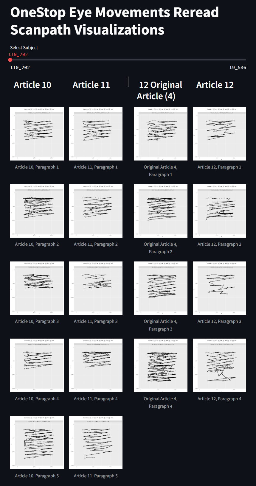
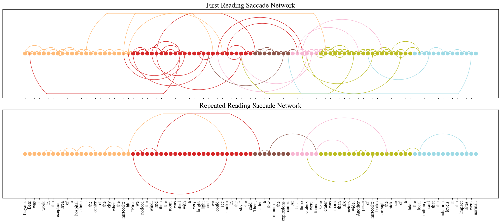

# Scanpath Visualization

## Introduction
This folder contains code and resources for visualizing scanpaths.

## Installation
To install the necessary dependencies, run the following command:
```bash
conda env create -f environment.yml
```

## Streamlit App for Reread Scanpath Comparison in OneStop Eye Movements

```
cd comparative-reread-streamlit-viz
```

#### Producing Scanpath Plots

`Rscript "create_rr_scanpath_plots.R"` 

#### Running the Streamlit App

`streamlit run scanpath_visualizer.py`

#### Credit

This code was highly based on the code in this repository: https://github.com/tmalsburg/scanpath

#### Example




## Arcplot Scanpath Visualization

The file `arcplot-viz.ipynb` contains example code to create an arcplot scanpath visualization using OneStop Eye Movements

#### Example


