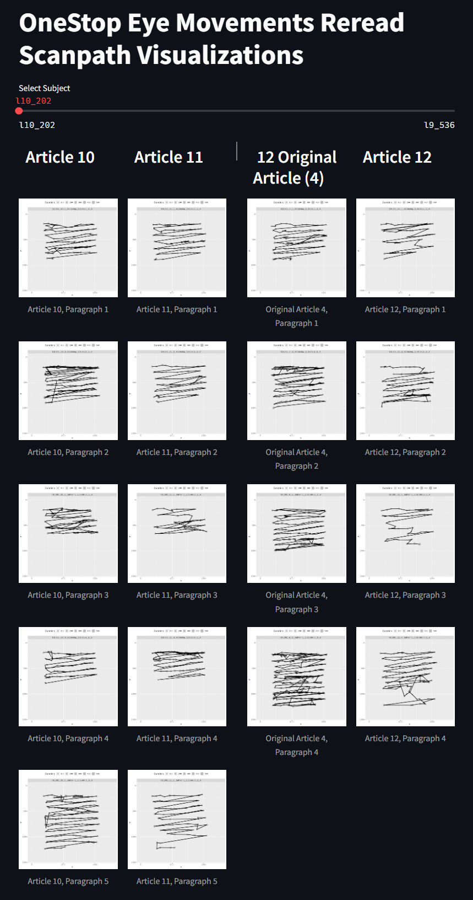

# Scanpath Plots and Streamlit App

## Overview

This guide provides instructions on how to produce scanpath plots and run the Streamlit app for visualizing RR scanpaths.

## Prerequisites

- Python 3.7+
- streamlit
- pillow

## Producing Scanpath Plots

`Rscript "create_rr_scanpath_plots.R"` 

## Running the Streamlit App

`streamlit run scanpath_visualizer.py`

## Contact

For any issues or questions, please open an issue in the repository or contact the maintainers.

## Credit

This code was highly based on the code in this repository: https://github.com/tmalsburg/scanpath

## Example

